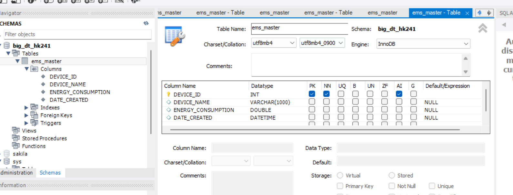

# nhóm BIG-DT-HK241

## setup project
1. install java11
2. install maven, install mysql
3. mvn clean install
4. mvn jetty:run

user can access application via link
[http://localhost:8080/ems/](http://localhost:8080/ems/)
[http://localhost:8080/ems/index.jsp](http://localhost:8080/ems/index.jsp)

## table structure

table ems_master

| Column      | Column                                 | Column                | conlumn          |
|-------------|----------------------------------------|-----------------------|------------------|
| DEVICE_ID   | DEVICE_NAME                            | ENERGY_CONSUMPTION    | DATE_MODIFIED    |
| ----------- | --------------                         | -------------------   | ---------------- |
| INT         | VARCHAR(5000)                          | DOUBLE                | DATETIME         |
|-------------| -------------------------------------- | --------------------- |------------------|

